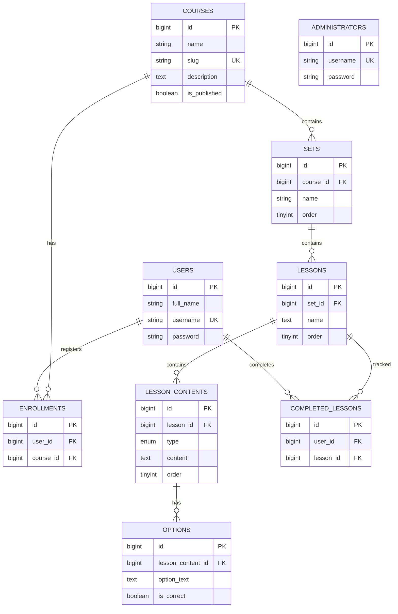

# Web Tech Studio ER diagram reference

```mermaid
erDiagram
    USERS ||--o{ ENROLLMENTS : registers
    COURSES ||--o{ ENROLLMENTS : has
    COURSES ||--o{ SETS : contains
    SETS ||--o{ LESSONS : contains
    LESSONS ||--o{ LESSON_CONTENTS : contains
    LESSON_CONTENTS ||--o{ OPTIONS : has
    USERS ||--o{ COMPLETED_LESSONS : completes
    LESSONS ||--o{ COMPLETED_LESSONS : tracked

    USERS { bigint id PK string full_name string username UK string password }
    ADMINISTRATORS { bigint id PK string username UK string password }
    COURSES { bigint id PK string name string slug UK text description boolean is_published }
    SETS { bigint id PK bigint course_id FK string name tinyint order }
    LESSONS { bigint id PK bigint set_id FK text name tinyint order }
    LESSON_CONTENTS { bigint id PK bigint lesson_id FK enum type text content tinyint order }
    OPTIONS { bigint id PK bigint lesson_content_id FK text option_text boolean is_correct }
    ENROLLMENTS { bigint id PK bigint user_id FK bigint course_id FK }
    COMPLETED_LESSONS { bigint id PK bigint user_id FK bigint lesson_id FK }
```
