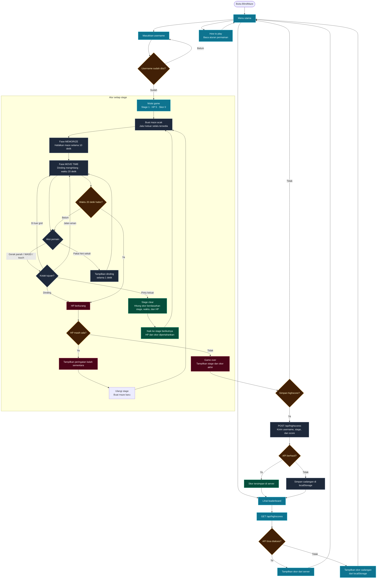

# Flowchart Alur BlindMaze Arcade

Flowchart ini menjelaskan perjalanan pemain dari menu utama sampai skor tersimpan di leaderboard. Istilah di dalam diagram dibuat mengikuti tampilan game agar mudah dipahami saat presentasi atau penilaian project.

## Ringkasan alur

1. Pemain mengisi username dari menu utama.
2. Game membuat maze acak yang tetap memiliki jalur keluar.
3. Pemain menghafalkan maze selama 10 detik.
4. Setelah dinding menghilang, pemain memiliki waktu 20 detik untuk mencari pintu keluar.
5. Menabrak dinding atau kehabisan waktu mengurangi HP dan mengulang stage.
6. Jika HP habis, hasil akhir dapat disimpan ke API atau cadangan localStorage.
7. Berhasil mencapai pintu keluar menaikkan stage dan mempertahankan skor serta HP.
